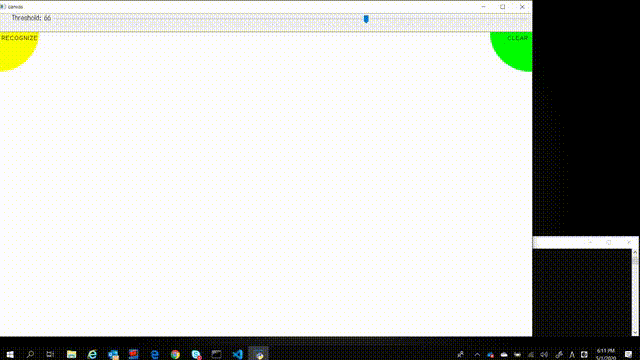

# Handwritten Japanese Deep Learning Based OCR with Touch Panel Demo
This is a handwritten Japanese OCR demo program based on a sample program from [**Intel(r) Distribution of OpenVINO(tm) Toolkit 2020.2**](https://software.intel.com/en-us/openvino-toolkit) (`handwritten-japanese-recognition.py`)  
The demo program has simple UI and you can write Japanese on the screen with the touch panel by your finger tip and try Japanese OCR performance.  
The demo uses a pre-trained text-detection DL model (`text-detection-0003`) from Intel(r) [Open Model Zoo](https://github.com/opencv/open_model_zoo) to detect the text regions from the canvas and run a DL based OCR model for those text regions.  

手書き日本語OCRデモです。[**Intel(r) Distribution of OpenVINO(tm) toolkit 2020.2**](https://software.intel.com/en-us/openvino-toolkit)に付属の`handwritten-japanese-recognition.py`デモを大幅に書き換えています。  
簡単なUIを用意していますのでタッチパネル付きPCがあれば指で字を書いて認識させるデモを行うことが可能です。  
Intel(r) [Open Model Zoo](https://github.com/opencv/open_model_zoo)の文字検出DLモデル(`text-detection-0003`)で自動領域識別も行ない、DL-OCRモデルで文字認識を行います。  

[NEW 03-Apr-2022] Added C++ postprocess version. **Text detection postprocess performance improved by ~x20.** (handwritten-japanese-ocr-touch-panel-demo-cpp.py).  
[NEW 03-Apr-2022] Migrated OpenVINO API to API 2.0 for both native Python version and C++ postprocess version. (OpenVINO 2022.1 support)

  

### Required DL Models to Run This Demo

The demo expects the following models in the Intermediate Representation (IR) format:

   * handwritten-japanese-recognition-0001
   * text-detection-0003

You can download those models from OpenVINO [Open Model Zoo](https://github.com/opencv/open_model_zoo).
In the `models.lst` is the list of appropriate models for this demo that can be obtained via `Model downloader`.
Please see more information about `Model downloader` [here](../../../tools/downloader/README.md).

## How to Run

(Assuming you have successfully installed and setup OpenVINO 2020.2. If you haven't, go to the OpenVINO web page and follow the [*Get Started*](https://software.intel.com/en-us/openvino-toolkit/documentation/get-started) guide to do it.)  

### 1. Install dependencies  
The demo depends on:
- opencv-python
- numpy

To install all the required Python modules you can use:

``` sh
(Linux) python3 -m pip install -r requirements.txt
(Win10) python -m pip install -r requirements.txt
```

### 2. Download DL models from OMZ
Use `Model Downloader` to download the required models.
``` sh
(Linux/Win10) omz_downloader --list models.lst
```

### 3. Build C++ postprocess Python module (Optional)
Prerequisites: To build the C++ postprocess Python module, you need to install OpenVINO dev package and OpenCV dev package. OpenVINO and OpenCV must be found by cmake. 
Please refer to the [OpenVINO install guide](https://docs.openvino.ai/latest/openvino_docs_install_guides_overview.html) for details.  
```sh
(Linux)
  source setup_ocv_vars.sh
  ./build.sh
 
(Win10)
  setup_ocv_vars.bat
  build.bat
```

### 4. Run the demo app
This program doesn't take any command line arguments. All file names and paths are hard coded in the source code.
``` sh
(Linux) python3 handwritten-japanese-OCR-touch-panel-demo.py
(Win10) python handwritten-japanese-OCR-touch-panel-demo.py
```

Please make sure the following files are placed at the proper location.
```
./  
+ handwritten_japanese-OCR-touch-panel-demo.py  
+ data  
| + kondate_nakayosi_char_list.txt  
+ intel  
| + handwritten-japanese-recognition-0001  
| | + FP16  
| | | + handwritten-japanese-recognition-0001.xml  
| | | + handwritten-japanese-recognition-0001.bin  
| + text-detection-0003  
| | + FP16  
| | | + text-detection-0003.xml  
| | | + text-detection-0003.bin  
```

## Demo Output  
The application uses the terminal to show resulting recognition text strings.  

## Tested Environment  
- Windows 11 x64  
- Intel(r) Distribution of OpenVINO(tm) toolkit 2022.1  
- Python 3.7 x64  

## See Also  
* [Using Open Model Zoo demos](../../README.md)  
* [Model Optimizer](https://docs.openvinotoolkit.org/latest/_docs_MO_DG_Deep_Learning_Model_Optimizer_DevGuide.html)  
* [Model Downloader](../../../tools/downloader/README.md)  
